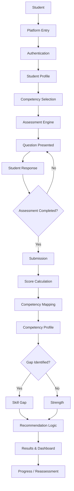
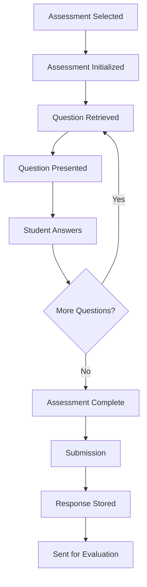
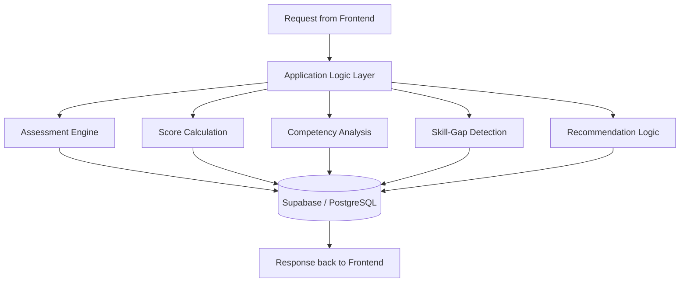
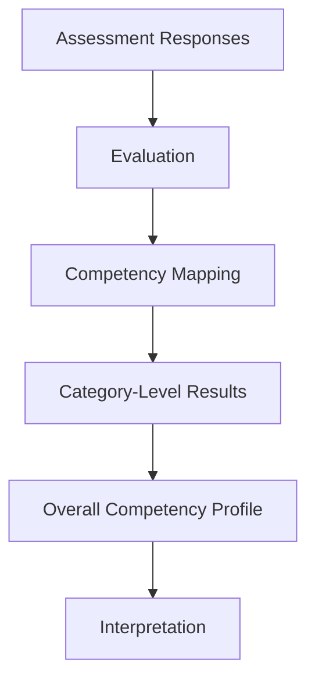
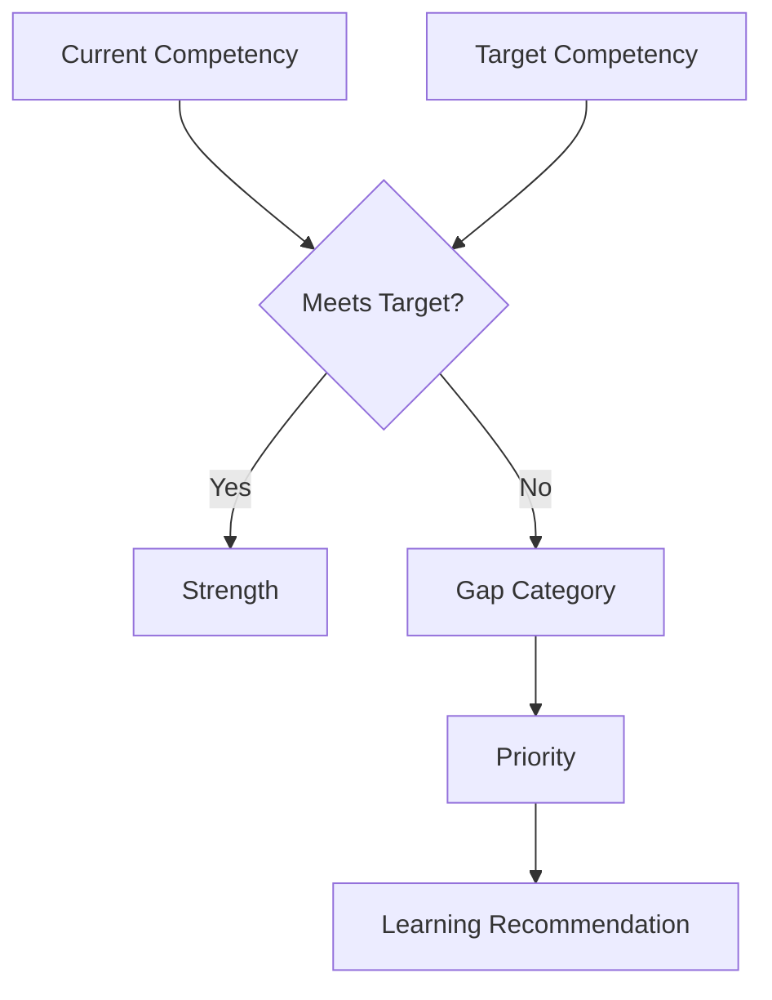
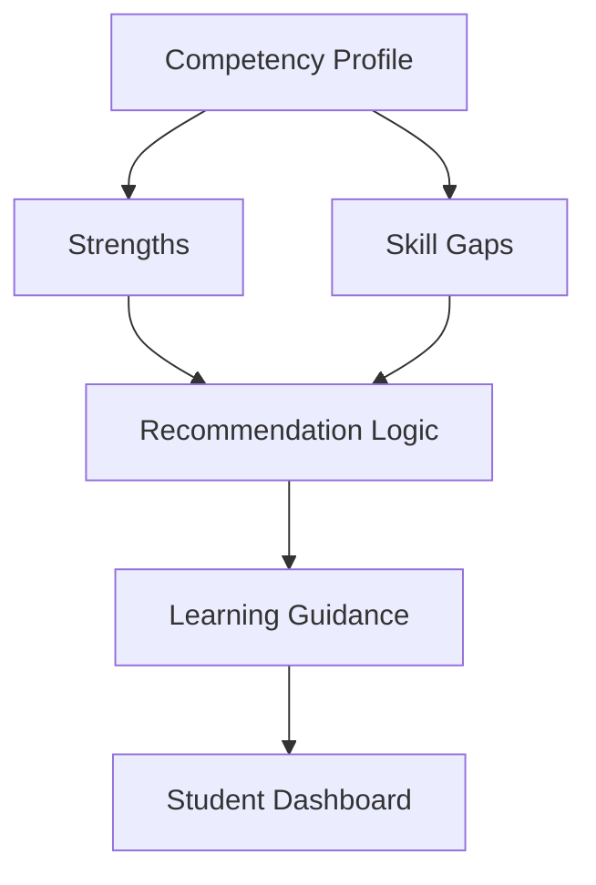
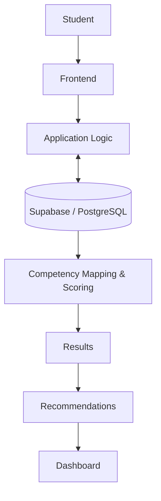
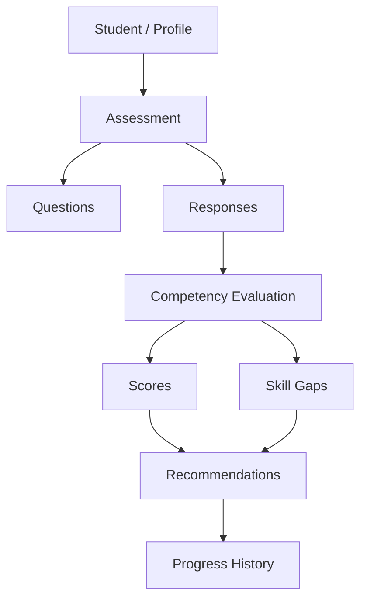
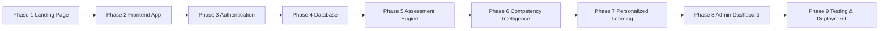

# CompetencyIQ — System Workflow

> Technical workflow companion to `README.md`. It walks through how CompetencyIQ works end to end, from platform entry to competency results and recommendations.
>
> Each stage carries one status tag: ✅ **Implemented**, 🚧 **In Progress**, 🔄 **Planned**, 🧩 **Conceptual**, or 🔮 **Future**. The legend and §15 are the authoritative reference for project maturity — the rest of this document focuses on how the system works.

---

## 1. Workflow Overview

CompetencyIQ turns a single test score into a full loop:

**Assessment → Analysis → Skill Gaps → Recommendations → Improvement → Progress**

A student enters the platform, authenticates, takes a competency assessment, and receives a breakdown of their strengths, gaps, and next learning steps — all visible on a personal dashboard. The system is being built in phases (§16), starting from the landing page currently live in the repository.

---

## 2. System at a Glance

| Layer | Role | Status |
|---|---|---|
| Landing Page | Introduces the platform | ✅ |
| Application Pages (login, signup, dashboard, assessment, results, profile) | The functional frontend | 🚧 |
| Authentication (Supabase Auth) | Register / log in / manage sessions | 🔄 |
| Assessment Engine | Serve questions, capture responses | 🔄 |
| Scoring & Competency Analysis | Turn responses into competency data | 🔄 |
| Skill-Gap Detection | Compare current vs. target competency | 🔄 |
| Recommendation Logic | Suggest learning paths | 🔄 |
| AI-Powered Personalization | Adaptive, intelligent recommendations | 🔮 |
| Database (Supabase / PostgreSQL) | Store all platform data | 🔄 |
| Admin / Institutional Dashboard | Aggregate analytics | 🔮 |

---

## 3. Complete End-to-End Workflow

The full CompetencyIQ loop — the reference diagram the rest of the document expands on.



---

## 4. Student / User Journey

| Stage | What Happens | Status |
|---|---|---|
| Platform Entry | Lands on the page, reads the pitch, sees the assessment CTA | ✅ |
| Authentication | Registers or logs in | 🔄 |
| Profile | Views/edits personal details | 🔄 |
| Competency Selection | Picks which competency to be assessed on | 🔄 |
| Assessment | Answers a set of questions | 🔄 |
| Results | Sees scores, strengths, gaps | 🔄 |
| Recommendations | Sees suggested next learning steps | 🔄 |
| Dashboard | Views overall competency profile and history | 🚧 |
| Reassessment | Retakes assessments to track change over time | 🔮 |

---

## 5. Assessment Workflow 🔄

What happens inside a single assessment attempt:



**Question types** (per README): multiple-choice, scenario-based, technical, problem-solving, communication, and domain-specific.

**Data movement — Submission**

| Input | Processing | Output | Next |
|---|---|---|---|
| Student's completed responses | System receives and validates the response set | Stored response record | Score Calculation |

---

## 6. Application / System Workflow 🔄

What the system does behind the scenes, mapped to the same journey:



**Data movement — general pattern**

| Input | Processing | Output | Next |
|---|---|---|---|
| Frontend data (credentials, responses, etc.) | Application Logic validates and routes to the right function | A processed result (session, score, record) | Persisted to Supabase and/or returned to the frontend |

`main.py` exists in the repo as an experimental file with no defined role in this layer.

---

## 7. Competency Evaluation Workflow 🧩

How responses become competency information:



**Competency Mapping**, in CompetencyIQ's terms: each question can belong to one or more competencies (e.g., a Programming question might map to "Fundamentals," "Problem Solving," or "Algorithms"). This is what lets the system report *specific* strengths and weaknesses instead of one blended score.

---

## 8. Strength & Skill-Gap Workflow 🧩



| Category | Meaning |
|---|---|
| 🟢 Strong | Meets or exceeds target |
| 🟡 Developing | Close to target |
| 🟠 Moderate Gap | Noticeable distance from target |
| 🔴 Significant Gap | Large distance from target |

Numeric thresholds between categories are customizable and defined at implementation time.

---

## 9. Recommendation Workflow



**Recommendation Logic 🔄** turns an identified gap into a sequenced list of learning steps (the README's example: a "Database Querying" gap → SQL fundamentals through practice projects).

**AI-Powered Personalization 🔮** adapts that sequence to a student's history and goals — a distinct, longer-term capability beyond the rule-based logic above.

---

## 10. Dashboard & Output Workflow 🚧

The dashboard brings everything together in one place:

| Section | Shows |
|---|---|
| Overall Competency | High-level profile summary |
| Competency Breakdown | Per-category scores |
| Strengths | Strong areas |
| Skill Gaps | Areas needing work |
| Recommendations | Suggested next steps |
| Assessment History | Past attempts |
| Progress Tracking | Change over time |

**Data movement — Dashboard**

| Input | Processing | Output | Next |
|---|---|---|---|
| Stored competency profile, gaps, recommendations | Frontend retrieves and renders per-section | Visual summary | Student acts on it, eventually reassesses |

---

## 11. Data Flow



---

## 12. Conceptual Data Model 🧩

Relationships between data categories, not a database schema.



| Category | Conceptual Purpose |
|---|---|
| Student / Profile | Identity and profile info |
| Assessment | Metadata for a given assessment |
| Questions | Items within an assessment, mapped to competencies |
| Responses | A student's submitted answers |
| Competency Evaluation | Turning responses into competency data |
| Scores | Category-level and overall results |
| Skill Gaps | Areas below target competency |
| Recommendations | Suggested steps tied to gaps |
| Progress History | Competency change across attempts |

---

## 13. System Architecture

```text
┌─────────────────────────────────────┐
│               STUDENT                │
└──────────────────┬────────────────────┘
                   ↓
┌─────────────────────────────────────┐
│         FRONTEND / STUDENT UI         │
│  Landing Page · Login · Signup ·      │
│  Dashboard · Assessment · Results ·   │
│  Profile                              │
└──────────────────┬────────────────────┘
                   ↓
┌─────────────────────────────────────┐
│     APPLICATION / LOGIC LAYER        │
│  Assessment Engine · Scoring ·        │
│  Competency Analysis ·                │
│  Skill-Gap Detection ·                │
│  Recommendation Logic                 │
└──────────────────┬────────────────────┘
                   ↓
┌─────────────────────────────────────┐
│               SUPABASE                │
│  Authentication · PostgreSQL ·        │
│  APIs · Row Level Security            │
└─────────────────────────────────────┘
```

---

## 14. System Components

| Component | Purpose | Input | Output | Status |
|---|---|---|---|---|
| Landing Page | Introduce the platform | Visitor request | Rendered page | ✅ |
| Client-side interactions | Navigation, CTA behavior | Clicks/scroll | UI response | ✅ |
| `main.py` | Experimental, role undefined | — | — | 🧩 |
| Authentication | Register/login/session | Credentials | Session | 🔄 |
| Student Profile | Store/display profile | Profile input | Profile record | 🔄 |
| Assessment Engine | Serve questions, capture answers | Selected assessment | Responses | 🔄 |
| Score Calculation | Evaluate responses | Responses | Scores | 🔄 |
| Competency Analysis | Interpret scores | Scores | Competency profile | 🔄 |
| Skill-Gap Detection | Compare current vs. target | Profile | Gap classification | 🔄 |
| Recommendation Logic | Suggest learning paths | Gaps | Recommendation list | 🔄 |
| Supabase / PostgreSQL | Store platform data | All records | Persisted data | 🔄 |
| Student Dashboard | Central results view | Stored data | Visual dashboard | 🚧 |
| Admin / Institutional Dashboard | Aggregate analytics | Student records | Insights | 🔮 |
| AI-Powered Recommendations | Intelligent personalization | Student history | Adaptive suggestions | 🔮 |

---

## 15. Current Implementation Status

| Feature | Status | Notes |
|---|---|---|
| Landing page (nav, hero, feature cards, CTA, about, footer) | ✅ | Live in the repo |
| Responsive styling & basic JS interactions | ✅ | `style.css`, `script.js` |
| GitHub repo + Codespaces | ✅ | Dev environment ready |
| Supabase project | ✅ (setup only) | Created, not yet integrated |
| Application pages (login, signup, dashboard, assessment, results, profile) | 🚧 | Phase 2 |
| Authentication | 🔄 | Phase 3 |
| Database schema & integration | 🔄 | Phase 4 |
| Assessment engine | 🔄 | Phase 5 |
| Competency analysis / skill-gap detection | 🔄 | Phase 6 |
| Personalized recommendations | 🔮 | Phase 7 |
| AI-powered / adaptive features | 🔮 | Future scope |
| Admin / institutional dashboard | 🔮 | Phase 8 |
| Testing & deployment | 🔮 | Phase 9 |

---

## 16. Planned Development Flow



---

## 17. Future Extensions 🔮

- AI-powered assessment generation and adaptive difficulty
- Career competency mapping
- Automatically generated learning paths
- Long-term progress analytics across semesters/years
- Institutional analytics and aggregate reporting
- Employability / industry skill mapping
- Portfolio integration (projects, certifications)
- Scalable production deployment

---

## 18. How It All Connects

A student lands on the platform, registers or logs in, builds a profile, and picks a competency area to be assessed on. The assessment engine presents questions one at a time until the set is complete, then the student submits. The Application Logic layer takes those responses, calculates scores, and maps them to specific competencies rather than one overall number. The resulting competency profile splits into strengths — where the student already meets the target level — and gaps, where they fall short and each gap gets a priority. The recommendation logic turns each gap into a concrete, sequenced set of next steps. Scores, strengths, gaps, and recommendations all surface together on the student's dashboard, which becomes their home base for understanding where they stand and what to do next. As students reassess over time, the same loop repeats and progress becomes visible.

That loop — **assess → analyze → identify → recommend → improve → reassess** — is the complete intended shape of CompetencyIQ. The landing page live today is the entry point into that loop; the rest is being built phase by phase per §16.
